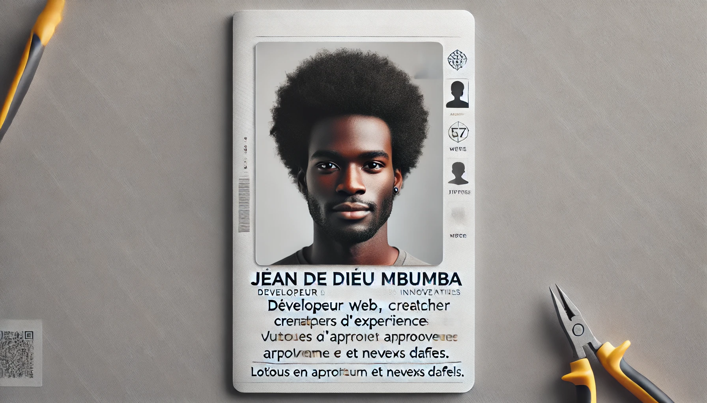

  

<h1 align="center">
    
</h1>

  
  
  
  

<h3 align="center">Passionné par le développement web et mobile 🚀</h3>
 

 

&nbsp;

🔭 I’m currently working on a marketplace

🌱 I’m currently learning Docker, Node.js, ReactJS

⚡ Fun fact Game of Thrones Night's Watch cloaks are made from Ikea rugs

 

<h2 align="center">⚒️ Languages-Frameworks-Tools ⚒️</h2>
 

    
     

 

 

  

###

  
  
  
  
  

###

<h1 align="center">hey there 👋</h1>

###

<h3 align="left">👩‍💻  About Me</h3>

###

 

<h4 align="left">Je suis un développeur web passionné avec 2 ans d'expérience, spécialisé en **Node.js**, **React.js**, et **PHP**. Mon travail se concentre sur la création d'applications web modernes et performantes, en mettant l'accent sur une expérience utilisateur fluide et intuitive.</h4>

###

<h3 align="left">🛠 Language and tools</h3>

###

  
  
  
  
  

###

<h3 align="left">🔥   My Stats :</h3>

###
